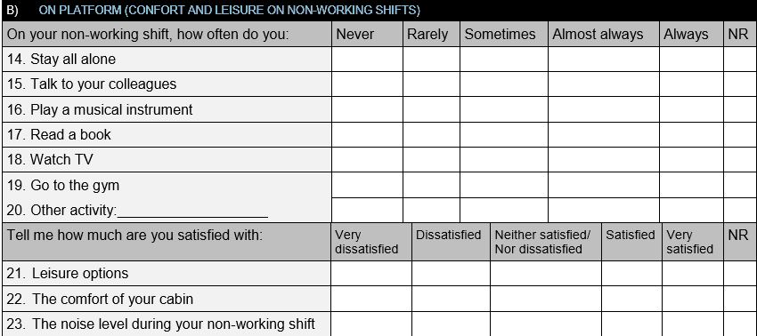

# Introduction

## Study goals

## Methods and materials


```{r setup, include=FALSE}
knitr::opts_chunk$set(echo = TRUE, cache = TRUE)

```

# Libraries

```{r libraries, cache=TRUE, include=FALSE}

library(dplyr)
library(plyr)
library(plotly)
library(ggplot2)
library(tidyr)
library(magrittr)
library(plotrix)
library(rgl)
library(car)
library(lubridate)
library(ggplot2)
library(GGally)
library(corrplot)
library(corrgram)
library(ppcor)
library(tidyverse)

```

## Variables

### CONFORT AND LEISURE ON NON-WORKING SHIFTS (ConfLeis)

* ON PLATFORM (CONFORT AND LEISURE ON NON-WORKING SHIFTS):   
* ConfLeisWC: From West Carina
* ConfleisPL: From Pioneiro Libra

**Coluns:** VAR00022 until VAR00032.

**Questionary location image**


# TIDYNG DATA

## Getting Data

```{r getting}

setwd("~/Analytic Hierarchy Process")

PioneiroLibra <- read_delim("PioneiroLibra.csv", ";", escape_double = FALSE, trim_ws = TRUE)

WestCarina <- read_delim("~/Analytic Hierarchy Process/WestCarina.csv", ";", escape_double = FALSE, trim_ws = TRUE)

# Function
# Transform vector into a data frame with frequency of levels and proportion
.Unianalysis = function (x) {
    y <- as.data.frame(table(x))
    y <- arrange(y, desc(y$x))
         return(y)
}

dimWC <- dim(WestCarina)
dimPL <- dim(PioneiroLibra)

#West Carina
glimpse(WestCarina)
glimpse(PioneiroLibra)

```

## Select variables of WC and PL from ConfLeis 

```{r select}

## Select variables of WC and PL
ConfLeisWC <-
        WestCarina %>% 
        dplyr::select(VAR00022:VAR00028)
ConfLeisPL <-
        PioneiroLibra %>% 
        dplyr::select(VAR00022:VAR00028)


```

## Put together WC and PL 

```{r  tidyng}

# Put together WC and PL
Two_Platform <- rbind.data.frame(ConfLeisWC, ConfLeisPL)

#Put variable names
names(Two_Platform) <- c("Privacy", "Talk_t_colleagues", "Play_instrument",  "Read_book", "Watch_TV","Gim","O_activity")

dim(Two_Platform)

```

## Tabulate each column

```{r tabulate and reshape}

#Analisy each column
ConfLeis_Explo <- apply(Two_Platform,2,.Unianalysis)

# Transform into dataframe
dframe <- ldply(ConfLeis_Explo, data.frame)

# reshape tabulation
Tidydata <- dframe %>%
       reshape(v.names = "Freq", idvar = ".id", timevar="x", direction = "wide")

# translate columns names
names(Tidydata) <- c("Variables", "Freq.Always", "Freq.Rarely", "Freq.Almost_always", "Freq.Sometimes", "Freq.Not_answered")

#Tidy table
DT::datatable(Tidydata)
      

```

# Normalization

Scale: 1 - 6,being 1 a week point, 5 a strong point, and 6 means not responded

**Scale:** Never: 0.4 
           Rarely: 0.6 
           Sometimes: 0.8 
           Almost always: 1.2 
           Always: 2 
           NR:0

```{r}


```


# Referências

CUANDRAS, C. M. NUEVOS MÉTODOS DE AN£LISIS MULTIVARIANTE. Propriedadade c.M. Cuadras
CMC Editions. Agramunt, 16, 08023 Barcelona, Spain: Revisado 21 de Junio de 2019. Disponível em http://www.ub.edu/stat/personal/cuadras/metodos.pdf


VICINI, L. Análise multivariada da teoria à prática / Lorena Vicini; orientador Adriano Mendonça Souza. - Santa Maria : UFSM, CCNE, 2005. 215 p. : il. 
