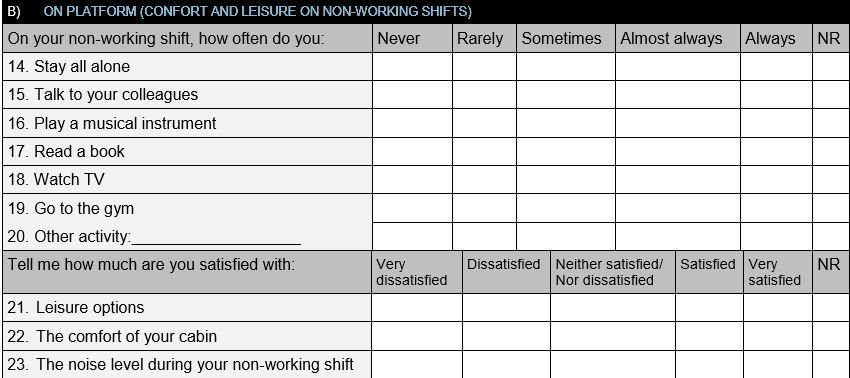

# Analytic Hierarchy Process (AHP)

Em desenvolvimento
## Domain Background  

Em desenvolvimento
## Study goals

**Main Goal:** 

Em desenvolvimento

## Methods and materials

Em desenvolvimento


# Libraries


## Normalization

Scale: 1 - 6,being 1 a week point, 5 a strong point, and 6 means not responded

## Variables

### CONFORT AND LEISURE ON NON-WORKING SHIFTS (ConfLeis)

* ON PLATFORM (CONFORT AND LEISURE ON NON-WORKING SHIFTS):   
* ConfLeisWC: From West Carina
* ConfleisPL: From Pioneiro Libra

**Coluns:** VAR00022 until VAR00032.

**Scale:** Never: 0.4 
           Rarely: 0.6 
           Sometimes: 0.8 
           Almost always: 1.2 
           Always: 2 
           NR:0

**Questionary location image**


## Getting Data


```r
setwd("~/Analytic Hierarchy Process")

PioneiroLibra <- read_delim("PioneiroLibra.csv", ";", escape_double = FALSE, trim_ws = TRUE)
```

```
## Parsed with column specification:
## cols(
##   .default = col_character(),
##   VAR00001 = col_number(),
##   VAR00002 = col_number(),
##   VAR00143 = col_number(),
##   VAR00166 = col_number(),
##   VAR00252 = col_number(),
##   VAR00167 = col_number(),
##   VAR00235 = col_number(),
##   VAR00168 = col_number(),
##   VAR00245 = col_number(),
##   VAR00247 = col_number(),
##   VAR00152 = col_number(),
##   VAR00163 = col_number(),
##   VAR00164 = col_number(),
##   VAR00165 = col_number(),
##   VAR00169 = col_number(),
##   VAR00170 = col_number(),
##   VAR00233 = col_number(),
##   VAR00171 = col_number(),
##   VAR00237 = col_number(),
##   VAR00240 = col_number()
##   # ... with 4 more columns
## )
```

```
## See spec(...) for full column specifications.
```

```r
WestCarina <- read_delim("~/Analytic Hierarchy Process/WestCarina.csv", ";", escape_double = FALSE, trim_ws = TRUE)
```

```
## Parsed with column specification:
## cols(
##   .default = col_character(),
##   VAR00001 = col_number(),
##   VAR00002 = col_number(),
##   VAR00143 = col_number(),
##   VAR00166 = col_number(),
##   VAR00167 = col_number(),
##   VAR00168 = col_number(),
##   VAR00154 = col_number(),
##   VAR00157 = col_number(),
##   VAR00159 = col_number(),
##   VAR00162 = col_number(),
##   VAR00152 = col_number(),
##   VAR00163 = col_number(),
##   VAR00164 = col_number(),
##   VAR00165 = col_number(),
##   VAR00169 = col_number(),
##   VAR00170 = col_number(),
##   VAR00171 = col_number(),
##   VAR00231 = col_logical(),
##   VAR00232 = col_logical()
## )
## See spec(...) for full column specifications.
```

```r
# Function
# Transform vector into a data frame with frequency of levels and proportion
.Unianalysis = function (x) {
    y <- as.data.frame(as.table(table(x)))
    y <- arrange(y, desc(y$x))
    y <- mutate(y, Value = prop.table(y$Freq) * 10)
       return(y)
}

.Calc_conv = function(x) {
               y <- transform(x, Scale = c(2, 0.8, 1.2, 0.4, 0.6))
               y <- mutate(y, Result = Value * Scale)
               return(y)   
}
            
dimWC <- dim(WestCarina)
dimPL <- dim(PioneiroLibra)

#West Carina
glimpse(WestCarina)
```

```
## Observations: 102
## Variables: 232
## $ VAR00001 <dbl> 10, 20, 30, 40, 50, 60, 70, 80, 90, 100, 110, 120, 13...
## $ VAR00002 <dbl> 131120170, 131120170, 131120170, 131120170, 131120170...
## $ VAR00003 <chr> "Karina", "Karina", "Karina", "Karina", "Karina", "Ka...
## $ VAR00004 <chr> "West Carina", "West Carina", "West Carina", "West Ca...
## $ VAR00005 <chr> "Newpark", "PETROBRAS", "Halliburton", "Halliburton",...
## $ VAR00006 <chr> "Masculino", "Masculino", "Masculino", "Masculino", "...
## $ VAR00007 <chr> "Solteiro/Separado/Desquitado/Divorciado/Vi\xfavo", "...
## $ VAR00008 <chr> "N\xe3o", "N\xe3o", "N\xe3o", "Sim", "N\xe3o", "Sim",...
## $ VAR00009 <chr> "Nenhuma", "Nenhuma", "Nenhuma", "Uma crian\xe7a", "N...
## $ VAR00010 <chr> "Nenhuma", "Nenhuma", "Nenhuma", "Um adolescente", "N...
## $ VAR00011 <chr> "Nenhuma", "Nenhuma", "Nenhuma", "Um adulto", "Nenhum...
## $ VAR00012 <chr> "25 a 34 anos", "35 a 44 anos", "35 a 44 anos", "45 a...
## $ VAR00013 <chr> "Sup. Completo", "Sup. Completo", "Sup. Completo", "E...
## $ VAR00014 <chr> "Rio de Janeiro", "Goi\xe2nia-GO", "Rio de Janeiro", ...
## $ VAR00015 <chr> "Qu\xedmicos de Flu\xeddos", "Fiscaliza\xe7\xe3o", "P...
## $ VAR00016 <chr> "Qu\xedmico", "Engenheiro Fiscal", "Engenheiro Direci...
## $ VAR00017 <chr> "Cinco a seis anos", "Tr\xeas a quatro anos", "Mais d...
## $ VAR00018 <chr> "Cinco a seis anos", "Tr\xeas a quatro anos", "Mais d...
## $ VAR00019 <chr> "Quatorze dias", "Quatorze dias", "Quatorze dias", "Q...
## $ VAR00020 <chr> "Quatorze dias", "Vinte e um dias", "Sete", "Quatorze...
## $ VAR00021 <chr> NA, "Treze a 14 horas", "Doze horas", "Quatorze", "Do...
## $ VAR00022 <chr> "Raramente", "Sempre", "Sempre", "Sempre", "Quase sem...
## $ VAR00023 <chr> "Sempre", NA, "Sempre", "\xc0s vezes", "Quase sempre"...
## $ VAR00024 <chr> "Nunca", "Nunca", "Nunca", "Nunca", "Nunca", "Nunca",...
## $ VAR00025 <chr> "\xc0s vezes", "Nunca", "Sempre", "Sempre", "Sempre",...
## $ VAR00026 <chr> "Sempre", "Nunca", "Raramente", "\xc0s vezes", "\xc0s...
## $ VAR00027 <chr> "Quase sempre", "\xc0s vezes", "Sempre", "Sempre", "R...
## $ VAR00028 <chr> "Raramente", "Nunca", "Nunca", "Nunca", "Nunca", "Nun...
## $ VAR00029 <chr> "Nunca", "Nunca", "\xc0s vezes", "Nunca", "Nunca", "N...
## $ VAR00030 <chr> "Nunca", "Nunca", "Nunca", "Nunca", "Quase sempre", "...
## $ VAR00031 <chr> "Nunca", "Nunca", "Nunca", "Nunca", "Nunca", "\xc0s v...
## $ VAR00032 <chr> "Nunca", "Nunca", "Nunca", "Nunca", "Nunca", "Nunca",...
## $ VAR00033 <chr> "Nunca", "Nunca", "Nunca", "Nunca", "Nunca", "Nunca",...
## $ VAR00034 <chr> "Nunca", "Nunca", "Nunca", "Nunca", "Nunca", "Nunca",...
## $ VAR00036 <chr> "Nunca", "Nunca", "Nunca", "Nunca", "Nunca", "Nunca",...
## $ VAR00039 <chr> "Nunca", "Nunca", "Nunca", "Nunca", "Nunca", "Nunca",...
## $ VAR00040 <chr> "Nunca", "Nunca", "Nunca", "Nunca", "Nunca", "Nunca",...
## $ VAR00143 <dbl> 10, 10, 10, 10, 10, 10, 10, 10, 10, 10, 10, 10, 10, 3...
## $ VAR00166 <dbl> 10, 10, 10, 10, 10, 10, 10, 10, 10, 10, 10, 10, 10, 1...
## $ VAR00041 <chr> "Nem satisfeito/Nem insatisfeito", "Nem satisfeito/Ne...
## $ VAR00042 <chr> "Satisfeito", "Satisfeito", "Nem satisfeito/Nem insat...
## $ VAR00043 <chr> "Nem satisfeito/Nem insatisfeito", "Muito satisfeito"...
## $ VAR00044 <chr> "Sempre", "Quase sempre", "\xc0s vezes", "Nunca", "\x...
## $ VAR00045 <chr> "Quase sempre", "Nunca", "Nunca", "Nunca", "Nunca", "...
## $ VAR00046 <chr> "Sempre", "\xc0s vezes", "\xc0s vezes", "Nunca", "\xc...
## $ VAR00047 <chr> "Raramente", "Nunca", "\xc0s vezes", "Nunca", "Nunca"...
## $ VAR00048 <chr> "\xc0s vezes", "Raramente", "\xc0s vezes", "Nunca", "...
## $ VAR00049 <chr> "Raramente", "Nunca", "Nunca", "Nunca", "Raramente", ...
## $ VAR00050 <chr> "Raramente", "Nunca", "Nunca", "Nunca", "Raramente", ...
## $ VAR00051 <chr> "Nunca", "Nunca", "Nunca", "Nunca", "Nunca", "Nunca",...
## $ VAR00052 <chr> "Raramente", "Raramente", "\xc0s vezes", "Nunca", "\x...
## $ VAR00053 <chr> "\xc0s vezes", "Quase sempre", "Nunca", "Nunca", "Nun...
## $ VAR00054 <chr> "\xc0s vezes", "Raramente", "\xc0s vezes", "Nunca", "...
## $ VAR00055 <chr> "Nunca", "Quase sempre", "\xc0s vezes", "Nunca", "Nun...
## $ VAR00056 <chr> "Nunca", "Nunca", "Nunca", "Nunca", "Nunca", "Nunca",...
## $ VAR00057 <chr> "Nunca", "Raramente", "Nunca", "Nunca", "Nunca", "Nun...
## $ VAR00058 <chr> "Nunca", "Raramente", "Nunca", "Nunca", "Nunca", "Nun...
## $ VAR00059 <chr> "Nunca", "Nunca", "Nunca", "Nunca", "Nunca", "Nunca",...
## $ VAR00060 <chr> "Quase sempre", "Nunca", "Nunca", "Nunca", "Nunca", "...
## $ VAR00061 <chr> "Nunca", "Nunca", "Nunca", "Nunca", "Nunca", "Nunca",...
## $ VAR00062 <chr> "Quase sempre", "Nunca", "Nunca", "Nunca", "Nunca", "...
## $ VAR00063 <chr> "Quase sempre", "Nunca", "Nunca", "Nunca", "Nunca", "...
## $ VAR00064 <chr> "Ruim", "Muito bom", "Bom", "Bom", "Bom", "Bom", "Nem...
## $ VAR00134 <chr> "n\xe3o se aplica", "se aplica", "n\xe3o se aplica", ...
## $ VAR00133 <chr> "se aplica", "n\xe3o se aplica", "n\xe3o se aplica", ...
## $ VAR00132 <chr> "n\xe3o se aplica", "n\xe3o se aplica", "n\xe3o se ap...
## $ VAR00131 <chr> "se aplica", "n\xe3o se aplica", "n\xe3o se aplica", ...
## $ VAR00065 <chr> "se aplica", "n\xe3o se aplica", "n\xe3o se aplica", ...
## $ VAR00138 <chr> ",0", ",0", "1,0", "1,0", ",0", ",0", ",0", ",0", ",0...
## $ VAR00135 <chr> "n\xe3o se aplica", "se aplica", "n\xe3o se aplica", ...
## $ VAR00140 <chr> ",0", "1,0", ",0", ",0", ",0", ",0", ",0", ",0", ",0"...
## $ VAR00141 <chr> ",0", ",0", ",0", "1,0", ",0", ",0", ",0", ",0", ",0"...
## $ VAR00142 <chr> ",0", ",0", ",0", ",0", ",0", "1,0", ",0", ",0", ",0"...
## $ VAR00144 <chr> ",0", ",0", ",0", ",0", ",0", ",0", ",0", ",0", ",0",...
## $ VAR00145 <chr> ",0", ",0", ",0", ",0", ",0", ",0", ",0", ",0", ",0",...
## $ VAR00146 <chr> ",0", ",0", ",0", ",0", ",0", ",0", ",0", ",0", ",0",...
## $ VAR00149 <chr> ",0", ",0", ",0", ",0", ",0", ",0", ",0", ",0", ",0",...
## $ VAR00150 <chr> ",0", ",0", ",0", ",0", ",0", ",0", ",0", ",0", ",0",...
## $ VAR00153 <chr> ",0", ",0", ",0", ",0", ",0", ",0", ",0", ",0", ",0",...
## $ VAR00155 <chr> ",0", ",0", ",0", ",0", ",0", ",0", ",0", ",0", ",0",...
## $ VAR00158 <chr> ",0", ",0", ",0", ",0", ",0", ",0", ",0", ",0", ",0",...
## $ VAR00160 <chr> ",0", ",0", ",0", ",0", ",0", ",0", ",0", ",0", ",0",...
## $ VAR00066 <chr> "Muitas vezes", "\xc0s vezes", "Raramente", "\xc0s ve...
## $ VAR00067 <chr> "Nunca", "Raramente", "Nunca", "Nunca", "\xc0s vezes"...
## $ VAR00068 <chr> "Nunca", "Raramente", "Nunca", "Nunca", "Nunca", "Nun...
## $ VAR00069 <chr> "Raramente", "Raramente", "Nunca", "Nunca", "Nunca", ...
## $ VAR00070 <chr> "Nunca", "Raramente", "Raramente", "Raramente", "Nunc...
## $ VAR00071 <chr> "Nunca", "Raramente", "Raramente", "Nunca", "Nunca", ...
## $ VAR00072 <chr> "Raramente", "Nunca", "Nunca", "Nunca", "Nunca", "Nun...
## $ VAR00073 <chr> "Raramente", "Nunca", "Raramente", "Nunca", "Nunca", ...
## $ VAR00074 <chr> "Nunca", "Raramente", "Raramente", "Nunca", "Nunca", ...
## $ VAR00075 <chr> "Muitas vezes", "\xc0s vezes", "\xc0s vezes", "\xc0s ...
## $ VAR00076 <chr> "Nunca", "Nunca", "Raramente", "Nunca", "Nunca", "Nun...
## $ VAR00077 <chr> "Nunca", "Nunca", "Nunca", "Nunca", "Nunca", "Nunca",...
## $ VAR00078 <chr> "Nunca", "Nunca", "Nunca", "Nunca", "Nunca", "Nunca",...
## $ VAR00079 <chr> "Nunca", "Nunca", "Raramente", "Nunca", "Nunca", "Nun...
## $ VAR00167 <dbl> 10, 10, 10, 10, 10, 10, 10, 10, 10, 10, 10, 10, 10, 1...
## $ VAR00168 <dbl> 10, 10, 10, 10, 10, 10, 10, 10, 10, 10, 10, 10, 10, 1...
## $ VAR00080 <chr> "Nunca", "Raramente", "Raramente", "Nunca", "Nunca", ...
## $ VAR00081 <chr> "Raramente", "\xc0s vezes", "Raramente", "Nunca", "\x...
## $ VAR00082 <chr> "\xc0s vezes", "Nunca", "Raramente", "Nunca", "Rarame...
## $ VAR00083 <chr> "Nunca", "\xc0s vezes", "Nunca", "Nunca", "\xc0s veze...
## $ VAR00139 <chr> "Nunca", "Nunca", "Raramente", "Nunca", "Raramente", ...
## $ VAR00151 <chr> "Nunca", "Nunca", "Nunca", "Nunca", "Nunca", "Nunca",...
## $ VAR00154 <dbl> 10, 10, 10, 10, 10, 10, 10, 10, 10, 10, 10, 10, 10, 1...
## $ VAR00157 <dbl> 10, 10, 10, 10, 10, 10, 10, 10, 10, 10, 10, 10, 10, 1...
## $ VAR00159 <dbl> 10, 10, 10, 10, 10, 10, 10, 10, 10, 10, 10, 10, 10, 1...
## $ VAR00162 <dbl> 10, 10, 10, 10, 10, 10, 10, 10, 10, 10, 10, 10, 10, 1...
## $ VAR00084 <chr> "Raramente", "Raramente", "Raramente", "Nunca", "Nunc...
## $ VAR00085 <chr> "Nunca", "Nunca", "Nunca", "Nunca", "\xc0s vezes", "N...
## $ VAR00086 <chr> "Muitas vezes", "Muitas vezes", "Muitas vezes", "Muit...
## $ VAR00087 <chr> "Raramente", "\xc0s vezes", "Nunca", "Nunca", "Rarame...
## $ VAR00088 <chr> "Raramente", "Nunca", "Nunca", "Nunca", "Nunca", "Rar...
## $ VAR00089 <chr> "Nunca", "Nunca", "Nunca", "Nunca", "Nunca", "Nunca",...
## $ VAR00090 <chr> "Nunca", "Nunca", "Nunca", "Nunca", "\xc0s vezes", "N...
## $ VAR00091 <chr> "Raramente", "Nunca", "Nunca", "Nunca", "Raramente", ...
## $ VAR00092 <chr> "Raramente", "Nunca", "Raramente", "Nunca", "\xc0s ve...
## $ VAR00093 <chr> "\xc0s vezes", "\xc0s vezes", "\xc0s vezes", "\xc0s v...
## $ VAR00094 <chr> "\xc0s vezes", "Raramente", "\xc0s vezes", "Nunca", "...
## $ VAR00095 <chr> "Nunca", "Nunca", "\xc0s vezes", "Nunca", "\xc0s veze...
## $ VAR00137 <chr> "Nunca", "Nunca", "Nunca", "Nunca", "\xc0s vezes", "N...
## $ VAR00136 <chr> "Nunca", "Nunca", "Nunca", "Nunca", "Nunca", "Raramen...
## $ VAR00147 <chr> "Nunca", "Nunca", "Nunca", "Nunca", "Nunca", "Nunca",...
## $ VAR00148 <chr> "Nunca", "Nunca", "Nunca", "Nunca", "Nunca", "Nunca",...
## $ VAR00152 <dbl> 10, 10, 10, 10, 10, 10, 10, 10, 10, 10, 10, 10, 10, 1...
## $ VAR00163 <dbl> 10, 10, 10, 10, 10, 10, 10, 10, 10, 10, 10, 10, 10, 1...
## $ VAR00164 <dbl> 10, 10, 10, 10, 10, 10, 10, 10, 10, 10, 10, 10, 10, 1...
## $ VAR00165 <dbl> 10, 10, 10, 10, 10, 10, 10, 10, 10, 10, 10, 10, 10, 1...
## $ VAR00169 <dbl> 10, 10, 10, 10, 10, 10, 10, 10, 10, 10, 10, 10, 10, 1...
## $ VAR00170 <dbl> 10, 10, 10, 10, 10, 10, 10, 10, 10, 10, 10, 10, 10, 1...
## $ VAR00171 <dbl> 10, 10, 10, 10, 10, 10, 10, 10, 10, 10, 10, 10, 10, 1...
## $ VAR00096 <chr> "Sempre", "\xc0s vezes", "Sempre", "\xc0s vezes", "Mu...
## $ VAR00097 <chr> "Muitas vezes", "\xc0s vezes", "Sempre", "Raramente",...
## $ VAR00098 <chr> "Muitas vezes", "\xc0s vezes", "Sempre", "\xc0s vezes...
## $ VAR00099 <chr> "Sempre", "Raramente", "Raramente", "\xc0s vezes", "\...
## $ VAR00100 <chr> "Sempre", "Sempre", "Sempre", "Sempre", "Sempre", "Se...
## $ VAR00101 <chr> "Sempre", "Raramente", "Sempre", "Sempre", "Sempre", ...
## $ VAR00102 <chr> "Sempre", "Muitas vezes", "\xc0s vezes", "Muitas veze...
## $ VAR00103 <chr> "Qualquer pessoa que trabalha na plataforma", "Qualqu...
## $ VAR00104 <chr> "Raramente", "Raramente", "Raramente", "\xc0s vezes",...
## $ VAR00105 <chr> "Raramente", "Nunca", "Nunca", "\xc0s vezes", "Rarame...
## $ VAR00106 <chr> "Nunca", "Nunca", "Nunca", "Nunca", "Nunca", "Nunca",...
## $ VAR00107 <chr> "Nunca", "Nunca", "Nunca", "Nunca", "Nunca", "Nunca",...
## $ VAR00108 <chr> "Alguma coisa", "Conhe\xe7o bem", "Conhe\xe7o bem", "...
## $ VAR00109 <chr> "Conhe\xe7o bem", "Conhe\xe7o bem", "Conhe\xe7o bem",...
## $ VAR00110 <chr> "Leve", "Leve", "Leve", "Leve", "M\xe9dio", "Leve", "...
## $ VAR00111 <chr> "Alto", "M\xe9dio", "Alto", "Alto", "Leve", "Alto", "...
## $ VAR00112 <chr> "Alto", "Leve", "Alto", "Alto", "Nenhum", "Leve", "M\...
## $ VAR00113 <chr> "M\xe9dio", "Leve", "M\xe9dio", "M\xe9dio", "Nenhum",...
## $ VAR00114 <chr> "Alto", "Leve", "M\xe9dio", "Alto", "Nenhum", "Leve",...
## $ VAR00115 <chr> "Sempre", "Sempre", "Sempre", "Sempre", "Sempre", "Se...
## $ VAR00116 <chr> "Nunca", "Raramente", "Nunca", "Nunca", "Nunca", "Nun...
## $ VAR00117 <chr> "Muitas vezes", "\xc0s vezes", "\xc0s vezes", "Muitas...
## $ VAR00118 <chr> "Nem satisfeito/Nem insatisfeito", "Nem satisfeito/Ne...
## $ VAR00119 <chr> "Satisfeito", "Muito satisfeito", "Satisfeito", "Sati...
## $ VAR00120 <chr> "Satisfeito", "Satisfeito", "Muito satisfeito", "Sati...
## $ VAR00121 <chr> "Sempre", "Sempre", "Sempre", "Muitas vezes", "Sempre...
## $ VAR00122 <chr> "Muitas vezes", "Muitas vezes", "Sempre", "Muitas vez...
## $ VAR00123 <chr> "Nunca", "Raramente", "Nunca", "Raramente", "Nunca", ...
## $ VAR00124 <chr> "Nunca", "Nunca", "Nunca", "Raramente", "\xc0s vezes"...
## $ VAR00125 <chr> "Sempre", "Muitas vezes", "Sempre", "Muitas vezes", "...
## $ VAR00126 <chr> "\xc0s vezes", "Muitas vezes", "\xc0s vezes", "\xc0s ...
## $ VAR00127 <chr> "\xc0s vezes", "\xc0s vezes", "\xc0s vezes", "\xc0s v...
## $ VAR00128 <chr> "Nunca", "Nunca", "Nunca", "Nunca", "Nunca", "Nunca",...
## $ VAR00129 <chr> "\xc0s vezes", "Raramente", "Nunca", "Raramente", "Ra...
## $ VAR00161 <chr> "aplica", "N\xe3o se aplica", "N\xe3o se aplica", "N\...
## $ VAR00035 <chr> "aplica", "N\xe3o se aplica", "N\xe3o se aplica", "N\...
## $ VAR00037 <chr> "aplica", "N\xe3o se aplica", "N\xe3o se aplica", "N\...
## $ VAR00038 <chr> "N\xe3o se aplica", "aplica", "N\xe3o se aplica", "N\...
## $ VAR00130 <chr> "N\xe3o se aplica", "N\xe3o se aplica", "aplica", "N\...
## $ VAR00156 <chr> "N\xe3o se aplica", "N\xe3o se aplica", "aplica", "N\...
## $ VAR00172 <chr> "N\xe3o se aplica", "N\xe3o se aplica", "aplica", "N\...
## $ VAR00173 <chr> "N\xe3o se aplica", "N\xe3o se aplica", "N\xe3o se ap...
## $ VAR00174 <chr> "N\xe3o se aplica", "N\xe3o se aplica", "N\xe3o se ap...
## $ VAR00175 <chr> "N\xe3o se aplica", "N\xe3o se aplica", "N\xe3o se ap...
## $ VAR00176 <chr> "N\xe3o se aplica", "N\xe3o se aplica", "N\xe3o se ap...
## $ VAR00177 <chr> "N\xe3o se aplica", "N\xe3o se aplica", "N\xe3o se ap...
## $ VAR00178 <chr> "N\xe3o se aplica", "N\xe3o se aplica", "N\xe3o se ap...
## $ VAR00179 <chr> "N\xe3o se aplica", "N\xe3o se aplica", "N\xe3o se ap...
## $ VAR00180 <chr> "N\xe3o se aplica", "N\xe3o se aplica", "N\xe3o se ap...
## $ VAR00181 <chr> "N\xe3o se aplica", "N\xe3o se aplica", "N\xe3o se ap...
## $ VAR00182 <chr> "N\xe3o se aplica", "N\xe3o se aplica", "N\xe3o se ap...
## $ VAR00183 <chr> "N\xe3o se aplica", "N\xe3o se aplica", "N\xe3o se ap...
## $ VAR00184 <chr> "N\xe3o se aplica", "N\xe3o se aplica", "N\xe3o se ap...
## $ VAR00185 <chr> "N\xe3o se aplica", "N\xe3o se aplica", "N\xe3o se ap...
## $ VAR00186 <chr> "N\xe3o se aplica", "N\xe3o se aplica", "N\xe3o se ap...
## $ VAR00187 <chr> "N\xe3o se aplica", "N\xe3o se aplica", "N\xe3o se ap...
## $ VAR00188 <chr> "N\xe3o se aplica", "N\xe3o se aplica", "N\xe3o se ap...
## $ VAR00189 <chr> "N\xe3o se aplica", "N\xe3o se aplica", "N\xe3o se ap...
## $ VAR00190 <chr> "N\xe3o se aplica", "N\xe3o se aplica", "N\xe3o se ap...
## $ VAR00191 <chr> "N\xe3o se aplica", "N\xe3o se aplica", "N\xe3o se ap...
## $ VAR00192 <chr> "N\xe3o se aplica", "N\xe3o se aplica", "N\xe3o se ap...
## $ VAR00193 <chr> "N\xe3o se aplica", "N\xe3o se aplica", "N\xe3o se ap...
## $ VAR00194 <chr> "N\xe3o se aplica", "N\xe3o se aplica", "N\xe3o se ap...
## $ VAR00195 <chr> "N\xe3o se aplica", "N\xe3o se aplica", "N\xe3o se ap...
## $ VAR00196 <chr> "N\xe3o se aplica", "N\xe3o se aplica", "N\xe3o se ap...
## $ VAR00197 <chr> "N\xe3o se aplica", "N\xe3o se aplica", "N\xe3o se ap...
## $ VAR00198 <chr> "N\xe3o se aplica", "N\xe3o se aplica", "N\xe3o se ap...
## $ VAR00199 <chr> "N\xe3o se aplica", "N\xe3o se aplica", "N\xe3o se ap...
## $ VAR00200 <chr> "N\xe3o se aplica", "N\xe3o se aplica", "N\xe3o se ap...
## $ VAR00201 <chr> "N\xe3o se aplica", "N\xe3o se aplica", "N\xe3o se ap...
## $ VAR00202 <chr> "N\xe3o se aplica", "N\xe3o se aplica", "N\xe3o se ap...
## $ VAR00203 <chr> "N\xe3o se aplica", "N\xe3o se aplica", "N\xe3o se ap...
## $ VAR00204 <chr> "N\xe3o se aplica", "N\xe3o se aplica", "N\xe3o se ap...
## $ VAR00205 <chr> "N\xe3o se aplica", "N\xe3o se aplica", "N\xe3o se ap...
## $ VAR00206 <chr> "aplica", "N\xe3o se aplica", "N\xe3o se aplica", "N\...
## $ VAR00207 <chr> "aplica", "N\xe3o se aplica", "N\xe3o se aplica", "N\...
## $ VAR00208 <chr> "N\xe3o se aplica", "aplica", "N\xe3o se aplica", "ap...
## $ VAR00209 <chr> "N\xe3o se aplica", "N\xe3o se aplica", "aplica", "N\...
## $ VAR00210 <chr> "N\xe3o se aplica", "N\xe3o se aplica", "aplica", "N\...
## $ VAR00211 <chr> "N\xe3o se aplica", "N\xe3o se aplica", "aplica", "N\...
## $ VAR00212 <chr> "N\xe3o se aplica", "N\xe3o se aplica", "N\xe3o se ap...
## $ VAR00213 <chr> "N\xe3o se aplica", "N\xe3o se aplica", "N\xe3o se ap...
## $ VAR00214 <chr> "N\xe3o se aplica", "N\xe3o se aplica", "N\xe3o se ap...
## $ VAR00215 <chr> "N\xe3o se aplica", "N\xe3o se aplica", "N\xe3o se ap...
## $ VAR00216 <chr> "N\xe3o se aplica", "N\xe3o se aplica", "N\xe3o se ap...
## $ VAR00217 <chr> "N\xe3o se aplica", "N\xe3o se aplica", "N\xe3o se ap...
## $ VAR00218 <chr> "N\xe3o se aplica", "N\xe3o se aplica", "N\xe3o se ap...
## $ VAR00219 <chr> "N\xe3o se aplica", "N\xe3o se aplica", "N\xe3o se ap...
## $ VAR00220 <chr> "N\xe3o se aplica", "N\xe3o se aplica", "N\xe3o se ap...
## $ VAR00221 <chr> "N\xe3o se aplica", "N\xe3o se aplica", "N\xe3o se ap...
## $ VAR00222 <chr> "N\xe3o se aplica", "N\xe3o se aplica", "N\xe3o se ap...
## $ VAR00223 <chr> "N\xe3o se aplica", "N\xe3o se aplica", "N\xe3o se ap...
## $ VAR00224 <chr> "N\xe3o se aplica", "N\xe3o se aplica", "N\xe3o se ap...
## $ VAR00225 <chr> "N\xe3o se aplica", "N\xe3o se aplica", "N\xe3o se ap...
## $ VAR00226 <chr> "N\xe3o se aplica", "N\xe3o se aplica", "N\xe3o se ap...
## $ VAR00227 <chr> "N\xe3o se aplica", "N\xe3o se aplica", "N\xe3o se ap...
## $ VAR00228 <chr> "N\xe3o se aplica", "N\xe3o se aplica", "N\xe3o se ap...
## $ VAR00229 <chr> "N\xe3o se aplica", "N\xe3o se aplica", "N\xe3o se ap...
## $ VAR00230 <chr> "N\xe3o se aplica", "N\xe3o se aplica", "N\xe3o se ap...
## $ VAR00231 <lgl> NA, NA, NA, NA, NA, NA, NA, NA, NA, NA, NA, NA, NA, N...
## $ VAR00232 <lgl> NA, NA, NA, NA, NA, NA, NA, NA, NA, NA, NA, NA, NA, N...
```

```r
glimpse(PioneiroLibra)
```

```
## Observations: 74
## Variables: 258
## $ VAR00001 <dbl> 10, 20, 30, 40, 50, 60, 70, 80, 90, 100, 110, 120, 13...
## $ VAR00002 <dbl> 130420180, 130420180, 130420180, 130420180, 140420180...
## $ VAR00003 <chr> "Hermilio", "Hermilio", "Hermilio", "Hermilio", "Herm...
## $ VAR00004 <chr> "Pioneiro de LIbra: FPSO", "Pioneiro de LIbra: FPSO",...
## $ VAR00005 <chr> "Fratelli", "Fratelli", "Fratelli", "Fratelli", "Tk O...
## $ VAR00006 <chr> "Masculino", "Masculino", "Masculino", "Masculino", "...
## $ VAR00007 <chr> "Casado/Uni\xe3o Est\xe1vel/Morando juntos", "Casado/...
## $ VAR00008 <chr> "Sim", "Sim", "Sim", "Sim", "Sim", "Sim", "Sim", "Sim...
## $ VAR00009 <chr> "Duas crian\xe7as", "Nenhuma", "Nenhuma", "Nenhuma", ...
## $ VAR00010 <chr> "Nenhuma", "Tr\xeas adolescentes", "Um adolescente", ...
## $ VAR00011 <chr> "Nenhuma", "Nenhuma", "Nenhuma", "Nenhuma", "Um adult...
## $ VAR00012 <chr> "25 a 34 anos", "45 a 54 anos", "35 a 44 anos", "45 a...
## $ VAR00013 <chr> "M\xe9dio Completo", "M\xe9dio Completo", "M\xe9dio C...
## $ VAR00014 <chr> "Bom Jesus do NOrte-ES", "S\xe3o Fid\xe9lis-RJ", "Tra...
## $ VAR00015 <chr> "Hotelaria", "Hotelaria", "Hotelaria", "Mec\xe2nica",...
## $ VAR00016 <chr> "Arrumador", "Arrumador", "Auxiliar de Cozinha", "T\x...
## $ VAR00017 <chr> "Cinco a seis anos", "Mais de 10 anos", "Cinco a seis...
## $ VAR00018 <chr> "Cinco a seis anos", "Mais de 10 anos", "Sete a oito ...
## $ VAR00019 <chr> "Quatorze dias", "Quatorze dias", "Quatorze dias", "Q...
## $ VAR00020 <chr> "Quatorze dias", "Quatorze dias", "Quatorze dias", "Q...
## $ VAR00021 <chr> "Doze horas", "Doze horas", "Doze horas", "Doze horas...
## $ VAR00022 <chr> "Raramente", "Quase sempre", "Raramente", "Raramente"...
## $ VAR00023 <chr> "Sempre", "Quase sempre", "Nunca", "Sempre", "\xc0s v...
## $ VAR00024 <chr> "Nunca", "Nunca", "Sempre", "Nunca", "Nunca", "Nunca"...
## $ VAR00025 <chr> "\xc0s vezes", "Sempre", "Sempre", "Quase sempre", "\...
## $ VAR00026 <chr> "\xc0s vezes", "\xc0s vezes", "Nunca", "Sempre", "Rar...
## $ VAR00027 <chr> "Sempre", "Nunca", "Nunca", "Nunca", "Nunca", "Rarame...
## $ VAR00028 <chr> "Nunca", "Nunca", "Nunca", "Nunca", "Nunca", "Nunca",...
## $ VAR00029 <chr> "Nunca", "Nunca", "Nunca", "Nunca", "Nunca", "Nunca",...
## $ VAR00030 <chr> "Nunca", "Nunca", "Nunca", "Nunca", "Nunca", "Nunca",...
## $ VAR00031 <chr> "Nunca", "Nunca", "Nunca", "Nunca", "Nunca", "Nunca",...
## $ VAR00032 <chr> "Nunca", "Nunca", "Nunca", "Nunca", "Nunca", "\xc0s v...
## $ VAR00033 <chr> "Nunca", "Nunca", "Nunca", "Nunca", "Nunca", "Nunca",...
## $ VAR00034 <chr> "Nunca", "Nunca", "Nunca", "Nunca", "Nunca", "Nunca",...
## $ VAR00036 <chr> "Nunca", "Nunca", "Nunca", "Nunca", "Nunca", "Nunca",...
## $ VAR00039 <chr> "Nunca", "Nunca", "Nunca", "Nunca", "Nunca", "Nunca",...
## $ VAR00040 <chr> "Nunca", "Nunca", "Nunca", "Nunca", "Nunca", "Nunca",...
## $ VAR00143 <dbl> 10, 10, 10, 10, 10, 10, 10, 10, 10, 10, 10, 10, 10, 1...
## $ VAR00166 <dbl> 10, 10, 10, 10, 10, 10, 10, 10, 10, 10, 10, 10, 10, 1...
## $ VAR00252 <dbl> 10, 10, 10, 10, 10, 10, 10, 10, 10, 10, 10, 10, 10, 1...
## $ VAR00041 <chr> "Satisfeito", "Satisfeito", "Satisfeito", "Satisfeito...
## $ VAR00042 <chr> "Satisfeito", "Muito satisfeito", "Muito satisfeito",...
## $ VAR00043 <chr> "Satisfeito", "Muito satisfeito", "Muito satisfeito",...
## $ VAR00044 <chr> "Sempre", "Sempre", "Sempre", "Nunca", "Nunca", "Semp...
## $ VAR00045 <chr> "Nunca", "Quase sempre", "Nunca", "Nunca", "Raramente...
## $ VAR00046 <chr> "Sempre", "Sempre", "Sempre", "Nunca", "Raramente", "...
## $ VAR00047 <chr> "Nunca", "Nunca", "Nunca", "Nunca", "Raramente", "Nun...
## $ VAR00048 <chr> "Nunca", "Nunca", "Sempre", "Nunca", "Raramente", "Nu...
## $ VAR00049 <chr> "Nunca", "Nunca", "Nunca", "Nunca", "Raramente", "Nun...
## $ VAR00050 <chr> "\xc0s vezes", "Nunca", "Nunca", "Nunca", "Raramente"...
## $ VAR00051 <chr> "Nunca", "Nunca", "Nunca", "Nunca", "Raramente", "Nun...
## $ VAR00052 <chr> "\xc0s vezes", "Nunca", "Nunca", "Nunca", "Nunca", "N...
## $ VAR00053 <chr> "Nunca", "Nunca", "Nunca", "Nunca", "Nunca", "Nunca",...
## $ VAR00054 <chr> "Nunca", "Nunca", "Nunca", "Nunca", "Nunca", "Nunca",...
## $ VAR00055 <chr> "Nunca", "Nunca", "Nunca", "Nunca", "Nunca", "Nunca",...
## $ VAR00056 <chr> "Nunca", "Nunca", "Nunca", "Nunca", "Nunca", "Nunca",...
## $ VAR00057 <chr> "Nunca", "Nunca", "Nunca", "Nunca", "Nunca", "Nunca",...
## $ VAR00058 <chr> "Nunca", "Nunca", "Nunca", "Nunca", "Nunca", "Nunca",...
## $ VAR00059 <chr> "Nunca", "Nunca", "Nunca", "Nunca", "Nunca", "Nunca",...
## $ VAR00060 <chr> "Sempre", "Nunca", "Nunca", "Nunca", "Nunca", "Nunca"...
## $ VAR00061 <chr> "Nunca", "Nunca", "Nunca", "Nunca", "Nunca", "Nunca",...
## $ VAR00062 <chr> "Sempre", "Nunca", "Nunca", "Nunca", "Nunca", "Nunca"...
## $ VAR00063 <chr> "Nunca", "Nunca", "Nunca", "Nunca", "Nunca", "Nunca",...
## $ VAR00064 <chr> "Bom", "Bom", "Nem bom nem ruim", "Muito bom", "Nem b...
## $ VAR00134 <chr> "n\xe3o se aplica", "n\xe3o se aplica", "n\xe3o se ap...
## $ VAR00133 <chr> "n\xe3o se aplica", "n\xe3o se aplica", "n\xe3o se ap...
## $ VAR00132 <chr> "n\xe3o se aplica", "n\xe3o se aplica", "se aplica", ...
## $ VAR00131 <chr> "n\xe3o se aplica", "n\xe3o se aplica", "n\xe3o se ap...
## $ VAR00065 <chr> "n\xe3o se aplica", "n\xe3o se aplica", "n\xe3o se ap...
## $ VAR00138 <chr> ",0", ",0", ",0", "1,0", "1,0", "1,0", "1,0", ",0", "...
## $ VAR00135 <chr> "se aplica", "se aplica", "se aplica", "se aplica", "...
## $ VAR00234 <chr> ",0", ",0", ",0", "1,0", ",0", ",0", ",0", ",0", ",0"...
## $ VAR00140 <chr> ",0", ",0", ",0", ",0", ",0", ",0", ",0", ",0", ",0",...
## $ VAR00141 <chr> ",0", ",0", ",0", ",0", ",0", ",0", ",0", ",0", ",0",...
## $ VAR00142 <chr> ",0", ",0", ",0", ",0", ",0", ",0", ",0", ",0", ",0",...
## $ VAR00144 <chr> ",0", ",0", ",0", ",0", ",0", ",0", ",0", ",0", ",0",...
## $ VAR00145 <chr> ",0", ",0", ",0", ",0", ",0", ",0", ",0", ",0", ",0",...
## $ VAR00146 <chr> ",0", ",0", ",0", ",0", ",0", ",0", ",0", ",0", ",0",...
## $ VAR00149 <chr> ",0", ",0", ",0", ",0", ",0", ",0", ",0", ",0", ",0",...
## $ VAR00150 <chr> ",0", ",0", ",0", ",0", ",0", ",0", ",0", "1,0", ",0"...
## $ VAR00153 <chr> ",0", ",0", ",0", ",0", ",0", ",0", ",0", ",0", ",0",...
## $ VAR00155 <chr> ",0", ",0", ",0", ",0", ",0", ",0", ",0", ",0", ",0",...
## $ VAR00158 <chr> ",0", ",0", ",0", ",0", ",0", ",0", ",0", ",0", ",0",...
## $ VAR00236 <chr> ",0", ",0", ",0", ",0", "1,0", ",0", ",0", ",0", ",0"...
## $ VAR00160 <chr> ",0", ",0", ",0", ",0", ",0", ",0", ",0", ",0", ",0",...
## $ VAR00248 <chr> ",0", ",0", ",0", ",0", ",0", ",0", ",0", ",0", ",0",...
## $ VAR00241 <chr> ",0", ",0", ",0", ",0", ",0", ",0", ",0", ",0", ",0",...
## $ VAR00254 <chr> ",0", ",0", ",0", ",0", ",0", ",0", ",0", ",0", ",0",...
## $ VAR00253 <chr> ",0", ",0", ",0", ",0", ",0", ",0", ",0", ",0", ",0",...
## $ VAR00255 <chr> ",0", ",0", ",0", ",0", ",0", ",0", ",0", ",0", ",0",...
## $ VAR00256 <chr> ",0", ",0", ",0", ",0", ",0", ",0", ",0", ",0", ",0",...
## $ VAR00066 <chr> "Raramente", "\xc0s vezes", "\xc0s vezes", "Raramente...
## $ VAR00067 <chr> "Raramente", "Nunca", "Nunca", "Nunca", "Nunca", "Nun...
## $ VAR00068 <chr> "\xc0s vezes", "Nunca", "Nunca", "Nunca", "Nunca", "N...
## $ VAR00069 <chr> "Raramente", "Nunca", "Nunca", "\xc0s vezes", "\xc0s ...
## $ VAR00070 <chr> "Nunca", "Nunca", "Nunca", "Raramente", "\xc0s vezes"...
## $ VAR00071 <chr> "Nunca", "Nunca", "Nunca", "Raramente", "Nunca", "Rar...
## $ VAR00072 <chr> "Nunca", "Nunca", "Nunca", "Raramente", "Nunca", "Nun...
## $ VAR00073 <chr> "Nunca", "Nunca", "Nunca", "Nunca", "Raramente", "Nun...
## $ VAR00074 <chr> "Nunca", "Nunca", "Nunca", "Raramente", "Raramente", ...
## $ VAR00075 <chr> "Nunca", "Raramente", "\xc0s vezes", "Raramente", "Mu...
## $ VAR00076 <chr> "Nunca", "Nunca", "Nunca", "Raramente", "Nunca", "Nun...
## $ VAR00077 <chr> "Nunca", "Nunca", "Nunca", "Nunca", "Raramente", "Nun...
## $ VAR00078 <chr> "Nunca", "Nunca", "Nunca", "Nunca", "Nunca", "Nunca",...
## $ VAR00079 <chr> "Nunca", "Nunca", "Nunca", "Nunca", "Nunca", "Nunca",...
## $ VAR00167 <dbl> 10, 10, 10, 10, 10, 10, 10, 10, 10, 10, 10, 10, 10, 1...
## $ VAR00235 <dbl> 10, 10, 10, 20, 10, 10, 10, 10, 10, 10, 10, 10, 10, 1...
## $ VAR00168 <dbl> 10, 10, 10, 10, 10, 10, 10, 10, 10, 10, 10, 10, 10, 1...
## $ VAR00245 <dbl> 10, 10, 10, 10, 10, 10, 10, 10, 10, 10, 10, 10, 10, 1...
## $ VAR00247 <dbl> 10, 10, 10, 10, 10, 10, 10, 10, 10, 10, 10, 10, 10, 1...
## $ VAR00080 <chr> "Raramente", "Nunca", "Nunca", "Nunca", "Nunca", "Nun...
## $ VAR00081 <chr> "Nunca", "Nunca", "Nunca", "Nunca", "Raramente", "Rar...
## $ VAR00082 <chr> "Raramente", "Nunca", "Nunca", "Nunca", "Nunca", "Rar...
## $ VAR00083 <chr> "Nunca", "Nunca", "Nunca", "Nunca", "Nunca", "Nunca",...
## $ VAR00139 <chr> "Nunca", "Nunca", "Nunca", "Nunca", "Nunca", "Nunca",...
## $ VAR00151 <chr> "Nunca", "Nunca", "Nunca", "Nunca", "Nunca", "Nunca",...
## $ VAR00154 <chr> "Nunca", "Nunca", "Nunca", "Nunca", "Nunca", "Nunca",...
## $ VAR00157 <chr> "Nunca", "Nunca", "Nunca", "Nunca", "Nunca", "Nunca",...
## $ VAR00159 <chr> "Nunca", "Nunca", "Nunca", "Raramente", "Nunca", "Nun...
## $ VAR00162 <chr> "Nunca", "Nunca", "Nunca", "Nunca", "Nunca", "Nunca",...
## $ VAR00244 <chr> "Nunca", "Nunca", "Nunca", "Nunca", "Nunca", "Nunca",...
## $ VAR00257 <chr> "Nunca", "Nunca", "Nunca", "Nunca", "Nunca", "Nunca",...
## $ VAR00258 <chr> "Nunca", "Nunca", "Nunca", "Nunca", "Nunca", "Nunca",...
## $ VAR00259 <chr> "Nunca", "Nunca", "Nunca", "Nunca", "Nunca", "Nunca",...
## $ VAR00084 <chr> "Nunca", "Nunca", "Nunca", "Raramente", "Raramente", ...
## $ VAR00085 <chr> "Nunca", "Nunca", "Nunca", "Nunca", "Nunca", "Nunca",...
## $ VAR00086 <chr> "\xc0s vezes", "\xc0s vezes", "Muitas vezes", "Muitas...
## $ VAR00087 <chr> "Nunca", "Nunca", "Nunca", "Raramente", "Nunca", "Nun...
## $ VAR00088 <chr> "Nunca", "Nunca", "Nunca", "Nunca", "Nunca", "Nunca",...
## $ VAR00089 <chr> "Nunca", "Nunca", "Nunca", "Nunca", "Nunca", "Nunca",...
## $ VAR00090 <chr> "Nunca", "Nunca", "Nunca", "Nunca", "Nunca", "Nunca",...
## $ VAR00091 <chr> "Nunca", "Nunca", "Nunca", "Nunca", "\xc0s vezes", "\...
## $ VAR00092 <chr> "Nunca", "Nunca", "Nunca", "Raramente", "Nunca", "\xc...
## $ VAR00093 <chr> "\xc0s vezes", "Raramente", "\xc0s vezes", "Raramente...
## $ VAR00094 <chr> "\xc0s vezes", "Nunca", "Nunca", "Nunca", "Muitas vez...
## $ VAR00095 <chr> "Nunca", "Nunca", "Nunca", "Nunca", "Nunca", "Nunca",...
## $ VAR00137 <chr> "Nunca", "Nunca", "Nunca", "Nunca", "Nunca", "Nunca",...
## $ VAR00136 <chr> "Nunca", "Nunca", "Nunca", "Nunca", "Nunca", "Nunca",...
## $ VAR00147 <chr> "Nunca", "Nunca", "Nunca", "Nunca", "Nunca", "Nunca",...
## $ VAR00148 <chr> "Nunca", "Nunca", "Nunca", "Nunca", "Nunca", "Nunca",...
## $ VAR00152 <dbl> 10, 10, 10, 10, 10, 10, 10, 10, 10, 10, 10, 10, 10, 1...
## $ VAR00163 <dbl> 10, 10, 10, 10, 10, 10, 10, 10, 10, 10, 10, 10, 10, 1...
## $ VAR00164 <dbl> 10, 10, 10, 10, 10, 10, 10, 10, 10, 10, 10, 10, 10, 1...
## $ VAR00165 <dbl> 10, 10, 10, 10, 10, 10, 10, 10, 10, 10, 10, 10, 10, 1...
## $ VAR00169 <dbl> 10, 10, 10, 10, 20, 10, 10, 10, 10, 10, 10, 20, 10, 1...
## $ VAR00170 <dbl> 10, 10, 10, 10, 10, 10, 10, 10, 10, 10, 10, 10, 10, 1...
## $ VAR00233 <dbl> 10, 10, 20, 10, 10, 10, 10, 10, 10, 10, 10, 10, 10, 1...
## $ VAR00171 <dbl> 10, 10, 10, 10, 10, 10, 10, 10, 10, 10, 10, 10, 10, 1...
## $ VAR00237 <dbl> 10, 10, 10, 10, 30, 10, 10, 10, 10, 10, 40, 10, 10, 1...
## $ VAR00240 <dbl> 10, 10, 10, 10, 10, 10, 10, 10, 30, 10, 10, 10, 10, 1...
## $ VAR00239 <dbl> 10, 10, 10, 10, 10, 10, 10, 10, 30, 10, 10, 10, 10, 1...
## $ VAR00251 <dbl> 10, 10, 10, 10, 10, 10, 10, 10, 10, 10, 10, 10, 10, 1...
## $ VAR00250 <dbl> 10, 10, 10, 10, 10, 10, 10, 10, 10, 10, 10, 10, 10, 1...
## $ VAR00096 <chr> "\xc0s vezes", NA, "Sempre", NA, "Muitas vezes", "\xc...
## $ VAR00097 <chr> "\xc0s vezes", NA, "Muitas vezes", NA, "Muitas vezes"...
## $ VAR00098 <chr> "\xc0s vezes", NA, "Muitas vezes", NA, "\xc0s vezes",...
## $ VAR00099 <chr> "Nunca", NA, "Nunca", NA, "Muitas vezes", "\xc0s veze...
## $ VAR00100 <chr> "Sempre", "Sempre", "Sempre", "Sempre", "Sempre", "Se...
## $ VAR00101 <chr> "Sempre", "Sempre", "\xc0s vezes", "Muitas vezes", "S...
## $ VAR00102 <chr> "Raramente", "Raramente", "Raramente", "Sempre", "\xc...
## $ VAR00103 <chr> "Qualqueru t\xe9cnico", "Qualqueru t\xe9cnico", "Supe...
## $ VAR00104 <chr> "\xc0s vezes", "Raramente", "Raramente", "\xc0s vezes...
## $ VAR00105 <chr> "Nunca", "Nunca", "Nunca", "Nunca", "Raramente", "Nun...
## $ VAR00106 <chr> "Nunca", "Nunca", "Nunca", "Nunca", "Nunca", "Nunca",...
## $ VAR00107 <chr> "Nunca", "Nunca", "Nunca", "Nunca", "Nunca", "Nunca",...
## $ VAR00108 <chr> "Alguma coisa", "Alguma coisa", "Alguma coisa", "Algu...
## $ VAR00109 <chr> "Alguma coisa", "Conhe\xe7o bem", "Conhe\xe7o bem", "...
## $ VAR00110 <chr> "M\xe9dio", "M\xe9dio", "M\xe9dio", "M\xe9dio", "M\xe...
## $ VAR00111 <chr> "Leve", "Nenhum", "Leve", "M\xe9dio", "Alto", "Alto",...
## $ VAR00112 <chr> "Leve", "Nenhum", "Leve", "M\xe9dio", "Alto", "M\xe9d...
## $ VAR00113 <chr> "M\xe9dio", "Nenhum", "M\xe9dio", "Leve", "M\xe9dio",...
## $ VAR00114 <chr> "Nenhum", "Nenhum", "M\xe9dio", "M\xe9dio", "M\xe9dio...
## $ VAR00115 <chr> "Muitas vezes", "Sempre", "Sempre", "Sempre", "Sempre...
## $ VAR00116 <chr> "Nunca", "Nunca", "Nunca", "Nunca", "Nunca", "Nunca",...
## $ VAR00117 <chr> "Nunca", "Raramente", "Nunca", "Nunca", "\xc0s vezes"...
## $ VAR00118 <chr> "Satisfeito", "Satisfeito", "Satisfeito", "Muito sati...
## $ VAR00119 <chr> "Satisfeito", "Satisfeito", "Muito satisfeito", "Muit...
## $ VAR00120 <chr> "Satisfeito", "Satisfeito", "Satisfeito", "Muito sati...
## $ VAR00121 <chr> "\xc0s vezes", "Sempre", "Sempre", "Sempre", "\xc0s v...
## $ VAR00122 <chr> "Nunca", "Sempre", "Raramente", "Muitas vezes", "Muit...
## $ VAR00123 <chr> "Nunca", "Nunca", "Nunca", "Nunca", "Nunca", "Nunca",...
## $ VAR00124 <chr> "Nunca", "Nunca", "Nunca", "Nunca", "Nunca", "Nunca",...
## $ VAR00125 <chr> "Raramente", "\xc0s vezes", "Nunca", "\xc0s vezes", "...
## $ VAR00126 <chr> "Raramente", "\xc0s vezes", NA, "Sempre", "Raramente"...
## $ VAR00127 <chr> "Raramente", "\xc0s vezes", NA, "Nunca", "\xc0s vezes...
## $ VAR00128 <chr> "Nunca", "Nunca", NA, "Nunca", "Nunca", "Nunca", "Rar...
## $ VAR00129 <chr> "Raramente", "\xc0s vezes", NA, "Nunca", "Raramente",...
## $ VAR00161 <chr> "N\xe3o se aplica", "N\xe3o se aplica", "N\xe3o se ap...
## $ VAR00035 <chr> "N\xe3o se aplica", "N\xe3o se aplica", "N\xe3o se ap...
## $ VAR00037 <chr> "N\xe3o se aplica", "N\xe3o se aplica", "N\xe3o se ap...
## $ VAR00038 <chr> "N\xe3o se aplica", "N\xe3o se aplica", "N\xe3o se ap...
## $ VAR00130 <chr> "N\xe3o se aplica", "N\xe3o se aplica", "N\xe3o se ap...
## $ VAR00156 <chr> "N\xe3o se aplica", "N\xe3o se aplica", "N\xe3o se ap...
## $ VAR00172 <chr> "N\xe3o se aplica", "N\xe3o se aplica", "N\xe3o se ap...
## $ VAR00173 <chr> "N\xe3o se aplica", "N\xe3o se aplica", "N\xe3o se ap...
## $ VAR00174 <chr> "N\xe3o se aplica", "N\xe3o se aplica", "N\xe3o se ap...
## $ VAR00175 <chr> "N\xe3o se aplica", "N\xe3o se aplica", "N\xe3o se ap...
## $ VAR00176 <chr> "N\xe3o se aplica", "N\xe3o se aplica", "N\xe3o se ap...
## $ VAR00177 <chr> "N\xe3o se aplica", "aplica", "N\xe3o se aplica", "N\...
## $ VAR00178 <chr> "N\xe3o se aplica", "N\xe3o se aplica", "N\xe3o se ap...
## $ VAR00179 <chr> "N\xe3o se aplica", "N\xe3o se aplica", "N\xe3o se ap...
## $ VAR00180 <chr> "N\xe3o se aplica", "N\xe3o se aplica", "aplica", "N\...
## $ VAR00181 <chr> "N\xe3o se aplica", "N\xe3o se aplica", "N\xe3o se ap...
## $ VAR00182 <chr> "N\xe3o se aplica", "N\xe3o se aplica", "N\xe3o se ap...
## $ VAR00183 <chr> "N\xe3o se aplica", "N\xe3o se aplica", "N\xe3o se ap...
## $ VAR00184 <chr> "N\xe3o se aplica", "N\xe3o se aplica", "N\xe3o se ap...
## $ VAR00185 <chr> "aplica", "N\xe3o se aplica", "N\xe3o se aplica", "N\...
## $ VAR00186 <chr> "N\xe3o se aplica", "N\xe3o se aplica", "N\xe3o se ap...
## $ VAR00187 <chr> "N\xe3o se aplica", "N\xe3o se aplica", "N\xe3o se ap...
## $ VAR00188 <chr> "N\xe3o se aplica", "N\xe3o se aplica", "N\xe3o se ap...
## $ VAR00189 <chr> "N\xe3o se aplica", "N\xe3o se aplica", "N\xe3o se ap...
## $ VAR00190 <chr> "N\xe3o se aplica", "N\xe3o se aplica", "N\xe3o se ap...
## $ VAR00191 <chr> "N\xe3o se aplica", "N\xe3o se aplica", "N\xe3o se ap...
## $ VAR00192 <chr> "N\xe3o se aplica", "N\xe3o se aplica", "N\xe3o se ap...
## $ VAR00193 <chr> "N\xe3o se aplica", "N\xe3o se aplica", "N\xe3o se ap...
## $ VAR00194 <chr> "N\xe3o se aplica", "N\xe3o se aplica", "N\xe3o se ap...
## $ VAR00195 <chr> "N\xe3o se aplica", "N\xe3o se aplica", "N\xe3o se ap...
## $ VAR00196 <chr> "N\xe3o se aplica", "N\xe3o se aplica", "N\xe3o se ap...
## $ VAR00197 <chr> "N\xe3o se aplica", "N\xe3o se aplica", "N\xe3o se ap...
## $ VAR00198 <chr> "N\xe3o se aplica", "N\xe3o se aplica", "N\xe3o se ap...
## $ VAR00199 <chr> "N\xe3o se aplica", "N\xe3o se aplica", "N\xe3o se ap...
## $ VAR00200 <chr> "N\xe3o se aplica", "N\xe3o se aplica", "N\xe3o se ap...
## $ VAR00201 <chr> "N\xe3o se aplica", "N\xe3o se aplica", "N\xe3o se ap...
## $ VAR00202 <chr> "N\xe3o se aplica", "N\xe3o se aplica", "N\xe3o se ap...
## $ VAR00203 <chr> "N\xe3o se aplica", "N\xe3o se aplica", "N\xe3o se ap...
## $ VAR00204 <chr> "N\xe3o se aplica", "N\xe3o se aplica", "N\xe3o se ap...
## $ VAR00205 <chr> "N\xe3o se aplica", "N\xe3o se aplica", "N\xe3o se ap...
## $ VAR00238 <chr> ",0", ",0", ",0", ",0", ",0", ",0", "1,0", ",0", ",0"...
## $ VAR00242 <chr> ",0", ",0", ",0", ",0", ",0", ",0", ",0", ",0", ",0",...
## $ VAR00249 <chr> ",0", ",0", ",0", ",0", ",0", ",0", ",0", ",0", ",0",...
## $ VAR00206 <chr> "aplica", "N\xe3o se aplica", "N\xe3o se aplica", "N\...
## $ VAR00207 <chr> "N\xe3o se aplica", "N\xe3o se aplica", "N\xe3o se ap...
## $ VAR00208 <chr> "N\xe3o se aplica", "aplica", "aplica", "N\xe3o se ap...
## $ VAR00209 <chr> "aplica", "N\xe3o se aplica", "N\xe3o se aplica", "N\...
## $ VAR00210 <chr> "N\xe3o se aplica", "N\xe3o se aplica", "N\xe3o se ap...
## $ VAR00211 <chr> "N\xe3o se aplica", "N\xe3o se aplica", "N\xe3o se ap...
## $ VAR00212 <chr> "N\xe3o se aplica", "N\xe3o se aplica", "N\xe3o se ap...
## $ VAR00213 <chr> "N\xe3o se aplica", "N\xe3o se aplica", "N\xe3o se ap...
## $ VAR00214 <chr> "N\xe3o se aplica", "N\xe3o se aplica", "N\xe3o se ap...
## $ VAR00215 <chr> "N\xe3o se aplica", "N\xe3o se aplica", "N\xe3o se ap...
## $ VAR00216 <chr> "N\xe3o se aplica", "N\xe3o se aplica", "N\xe3o se ap...
## $ VAR00217 <chr> "N\xe3o se aplica", "N\xe3o se aplica", "N\xe3o se ap...
## $ VAR00218 <chr> "N\xe3o se aplica", "N\xe3o se aplica", "N\xe3o se ap...
## $ VAR00219 <chr> "N\xe3o se aplica", "N\xe3o se aplica", "N\xe3o se ap...
## $ VAR00220 <chr> "N\xe3o se aplica", "N\xe3o se aplica", "N\xe3o se ap...
## $ VAR00221 <chr> "N\xe3o se aplica", "N\xe3o se aplica", "N\xe3o se ap...
## $ VAR00222 <chr> "N\xe3o se aplica", "N\xe3o se aplica", "N\xe3o se ap...
## $ VAR00223 <chr> "N\xe3o se aplica", "N\xe3o se aplica", "N\xe3o se ap...
## $ VAR00224 <chr> "N\xe3o se aplica", "N\xe3o se aplica", "N\xe3o se ap...
## $ VAR00225 <chr> "N\xe3o se aplica", "N\xe3o se aplica", "N\xe3o se ap...
## $ VAR00226 <chr> "N\xe3o se aplica", "N\xe3o se aplica", "N\xe3o se ap...
## $ VAR00227 <chr> "N\xe3o se aplica", "N\xe3o se aplica", "N\xe3o se ap...
## $ VAR00228 <chr> "N\xe3o se aplica", "N\xe3o se aplica", "N\xe3o se ap...
## $ VAR00229 <chr> "N\xe3o se aplica", "N\xe3o se aplica", "N\xe3o se ap...
## $ VAR00230 <chr> "N\xe3o se aplica", "N\xe3o se aplica", "N\xe3o se ap...
## $ VAR00231 <chr> "N\xe3o se aplica", "N\xe3o se aplica", "N\xe3o se ap...
## $ VAR00232 <chr> "N\xe3o se aplica", "N\xe3o se aplica", "N\xe3o se ap...
## $ VAR00243 <lgl> NA, NA, NA, NA, NA, NA, NA, NA, NA, NA, NA, NA, NA, N...
```

## Select variables of WC and PL from ConfLeis 


```r
## Select variables of WC and PL
ConfLeisWC <-
        WestCarina %>% 
        dplyr::select(VAR00005:VAR00006, VAR00022:VAR00028)
ConfLeisPL <-
        PioneiroLibra %>% 
        dplyr::select(VAR00005:VAR00006, VAR00022:VAR00028)
```

## Put together WC and PL 


```r
# Put together WC and PL
Two_Platform <- rbind.data.frame(ConfLeisWC, ConfLeisPL)

#Put variable names
names(Two_Platform) <- c("CIA","Genre","Privacy", "Talk_t_colleagues", "Play_instrument",  "Read_book", "Watch_TV","Gim","O_activity")

dim(Two_Platform)
```

```
## [1] 176   9
```

## Analisy and tabulate each column


```r
#Analisy each column
ConfLeis_Explo <- apply(Two_Platform,2,.Unianalysis)
dim(ConfLeis_Explo)
```

```
## NULL
```

## Scale Calculation


```r
#Calculation of scale
Privacy <-  .Calc_conv(ConfLeis_Explo[["Privacy"]])
Play_instrument <-  .Calc_conv(ConfLeis_Explo$Play_instrument)
Read_book <-  .Calc_conv(ConfLeis_Explo$Read_book)
Gim <-  .Calc_conv(ConfLeis_Explo$Gim)
O_activity <-  .Calc_conv(ConfLeis_Explo$O_activity)

Privacy
```

```
##              x Freq    Value Scale    Result
## 1       Sempre   27 1.534091   2.0 3.0681818
## 2    Raramente   49 2.784091   0.8 2.2272727
## 3 Quase sempre   41 2.329545   1.2 2.7954545
## 4        Nunca   20 1.136364   0.4 0.4545455
## 5  <c0>s vezes   39 2.215909   0.6 1.3295455
```

```r
Play_instrument
```

```
##              x Freq     Value Scale    Result
## 1       Sempre    2 0.1136364   2.0 0.2272727
## 2    Raramente    7 0.3977273   0.8 0.3181818
## 3 Quase sempre    5 0.2840909   1.2 0.3409091
## 4        Nunca  155 8.8068182   0.4 3.5227273
## 5  <c0>s vezes    7 0.3977273   0.6 0.2386364
```

```r
Read_book
```

```
##              x Freq    Value Scale    Result
## 1       Sempre   33 1.875000   2.0 3.7500000
## 2    Raramente   33 1.875000   0.8 1.5000000
## 3 Quase sempre   26 1.477273   1.2 1.7727273
## 4        Nunca   41 2.329545   0.4 0.9318182
## 5  <c0>s vezes   43 2.443182   0.6 1.4659091
```

```r
Gim
```

```
##              x Freq    Value Scale   Result
## 1       Sempre   34 1.931818   2.0 3.863636
## 2    Raramente   27 1.534091   0.8 1.227273
## 3 Quase sempre   30 1.704545   1.2 2.045455
## 4        Nunca   44 2.500000   0.4 1.000000
## 5  <c0>s vezes   41 2.329545   0.6 1.397727
```

```r
O_activity
```

```
##              x Freq      Value Scale     Result
## 1       Sempre    6 0.34090909   2.0 0.68181818
## 2    Raramente    1 0.05681818   0.8 0.04545455
## 3 Quase sempre    8 0.45454545   1.2 0.54545455
## 4        Nunca  151 8.57954545   0.4 3.43181818
## 5  <c0>s vezes   10 0.56818182   0.6 0.34090909
```

## Final Score of ConfLeis


```r
# Final Score

FSP <- 5 - mean(Privacy$Result)
FSP
```

```
## [1] 3.025
```

```r
FSPI <- 5 - mean(Play_instrument$Result)
FSPI
```

```
## [1] 4.070455
```

```r
FSRB <- 5 - mean(Read_book$Result)
FSRB
```

```
## [1] 3.115909
```

```r
FSG <- 5 - mean(Gim$Result)
FSG
```

```
## [1] 3.093182
```

```r
Final_Score <- mean(FSP, FSPI,FSRB,FSG)
Final_Score 
```

```
## [1] 3.025
```


# Referências

CUANDRAS, C. M. NUEVOS MÉTODOS DE AN£LISIS MULTIVARIANTE. Propriedadade c.M. Cuadras
CMC Editions. Agramunt, 16, 08023 Barcelona, Spain: Revisado 21 de Junio de 2019. Disponível em http://www.ub.edu/stat/personal/cuadras/metodos.pdf


VICINI, L. Análise multivariada da teoria à prática / Lorena Vicini; orientador Adriano Mendonça Souza. - Santa Maria : UFSM, CCNE, 2005. 215 p. : il. 
